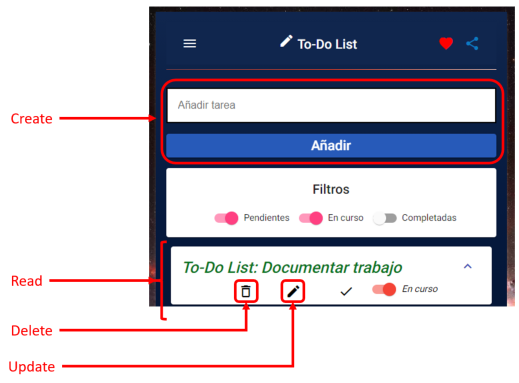
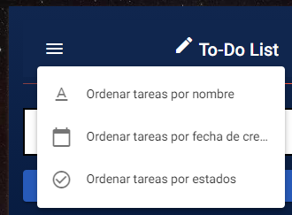
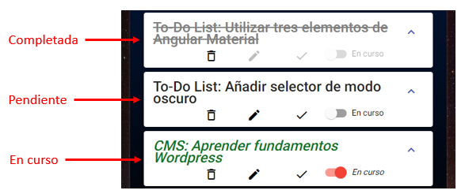
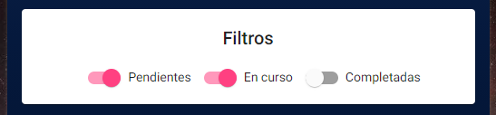

# To-DoListApp

Trabajo de la asignatura DAW II (Desarrollo de Aplicaciones Web II) consistente en una aplicación desarrollada en Angular que permita la gestión de una lista de tareas. 

**Autor** ✒️

* Francisco Javier López-Dufour Morales

## Construido con ⚙️

* Angular Framework: v11.2.13

    * Angular CLI: v11.2.12
    * Node.js. v14.15.4
    * npm package manager: v7.10.0
    * TypeScript: v4.1.5

## Funcionalidades 📋

### Funciones CRUD

La aplicación implementa las funciones básicas para Crear, Leer, Actualizar y Borrar elementos de la lista de tareas. 

<p align="center">
    
</p>

### Ordenar elementos

La aplicación permite ordenar elementos de la lista de acuerdo a tres criterios:

* Por fecha de creación
* Por orden alfabético
* O por estado

<p align="center">
    
</p>

### Clasificar elementos por estados

Cada elemento de la lista puede encontrarse en uno de estos tres estados:

* pendiente
* resuelto
* o en proceso

Cuando un elemento nuevo se crea, su estado es _pendiente_. Cuando un elemento cambia su estado a _resuelto_, pasa a un histórico. 

<p align="center">
    
</p>

### Filtrar elementos por estados

Utilizando componentes Slide toggle de Angular Material se aplican los filtros por estado en la lista:

<p align="center">
    
</p>

### Empleando Angular Material

Para este trabajo se han empleado varios componentes de la librería de Angular Material. Esta librería ofrece componentes web con un diseño Material design, una guía creada por Google. 

Algunos de los componentes utilizados han sido:

* `<mat-slide-toggle>` is an on/off control that can be toggled via clicking.
* `<mat-card>` is a content container for text, photos, and actions in the context of a single subject.
* `<mat-toolbar>` is a container for headers, titles, or actions.

### Almacenamiento 🛠️

Para el almacenamiento de las tareas se ha llevado a cabo mediante un fichero JSON:

```json
{
    "Item": [
      {
        "description": "To-Do List: Aprender Angular",
        "date": "Sat May 15 2019 17:18:22 GMT+0100 (hora de verano de Europa occidental)",
        "state": "done"
      },
      {
        "description": "To-Do List: Documentar trabajo",
        "date": "Sat May 15 2021 17:18:22 GMT+0100 (hora de verano de Europa occidental)",
        "state": "active"
      },
      // ...
    ]
}
```

## Despliegue 📦

La aplicación web se ha desplegado utilizando GitHub Pages, un espacio gratuito de la plataforma GitHub para almacenar los archivos que ejecuta un sitio web y alojar este sitio de manera estática: la información no se almacena en una base de datos sino que ya está contenida en los archivos del sitio.

```bash
ng build --prod --base-href "./"
ngh
```

## Background: Milky Way Center

**Fuente de la imagen**: https://www.flickr.com/photos/geckzilla/30386605114/

<p align="center">
    
</p>

---
